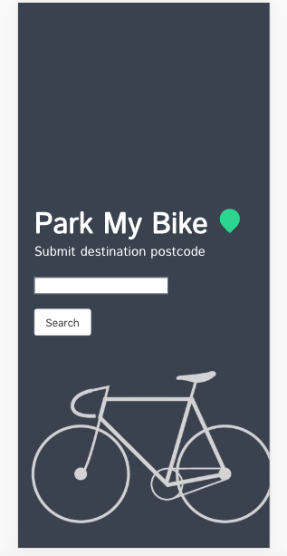
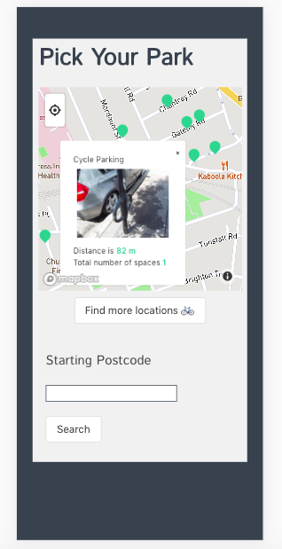
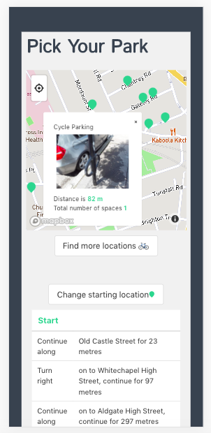
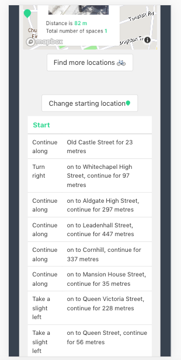

# Park My Bike

## Overview

My second project was a React web app giving you all surrounding bike park locations around a London postcode, with an additional feature of cycling directions from a 2nd postcode.

This was the second project from General Assembly Software Engineering Immersive, and was a 48 hour paired programming project.

Launch on [GitHub Pages](https://jonnysfarmer.github.io/park-my-bike/).  Check out the GitHub [Repo](https://github.com/jonnysfarmer/park-my-bike).

## Brief

- Pair program
- Create a react app that talks to an API and displays some data
- Use any API you like
- Deploy on Github pages

## Technologies Used
 - React
 - Axios
 - Bulma
 - Mapbox
 - React Router
 - CSS
 - JavaScript (ES6)
 - GitHub Pages
 - Webpack

### APIs used:
- [Postcode API](https://postcodes.io/)
- [TFL API](https://api.tfl.gov.uk/)

## Approach Taken

We had approximately 48 hours to plan, code and present our projects.  We investigated multiple free APIs which gave good quality data.  Once of our team was a keen cyclist and we came across the cycle park API from TFL.  We were also keen to use Mapbox as neither of us had used this before.

### Features
The key features was that a user could input their postcode.  This would then display all cycle-parks in a 250m radius of them on a map.  You can get more information about the specific cycle park when clicking on point of interest.  The user can then input another postcode giving directions cycling directions to that specific cycle park.

### Information Flow

A lot of this project was converting postcodes to Longitude / Latitude co-ordinates and vice-versa.  

 - User inputs destination postcode.  This is then converted to Long / Lat via the Postcode API and put into MapBox & the TFL cycle park API with the various locations posted on the map as pins.
 - The Long / Lat is passed via the URL.  If the user moves the map, to stop constant TFL API calls, there is a refresh button which re populates the map with parking points.
 - On pin click, the parking point information is displayed as a pop up including image, distance and number of parking points.
 - On Pop up click, it gives the user the ability to input a 'starting location' postcode for navigation.
 - On input, the park point location is converted from Long / Lat to a postcode via the Postcode API, and both postcodes are inputted into a TFL cycling directions API.
 - These directions are then mapped into a table and displayed.
 - The user starting postcode for the directions is saved so the user can find directions by clicking on additional pop ups without re inputing your starting location unless you click the rest button.

### Code Examples

We get the initial long / lat from the postcode API and pass this through the URL to the main page.

```javascript
  handleSubmit(e) {
    e.preventDefault()
    axios.get(`https://api.postcodes.io/postcodes/${this.state.postcode}`)
      .then(resp => {
        console.log(resp)
        this.setState({
          export: {
            longitude: resp.data.result.longitude,
            latitude: resp.data.result.latitude
          }
        })
        this.props.history.push(`/map/${this.state.export.latitude}/${this.state.export.longitude}`)
      })
      .catch(() => this.setState({ errors: 'Invalid Postcode' }))

  }
```

We set the initial state of our map location from the URL.  Tis is then passed to the hook which means we can re run the hook to find additional cycle parks as the maps viewport changes.

```javascript
  hook = () => {
    const lat = this.state.viewport.latitude
    const long = this.state.viewport.longitude
    axios.get(`https://api.tfl.gov.uk/Place?radius=250&type=CyclePark&placeGeo.lat=${lat}&placeGeo.lon=${long}`)
      .then(resp => this.setState({ bikedata: resp.data }))
      .catch(err => this.setState({ err: err.response.status }))
  }
```

### Screenshots
 





## Wins and Blockers

It was a good experience to work as a pair, with such a short deadline.  I think we pushed eachother and came up with good mobile friendly product in a relatively short period of time.

We had a lot of async issues, as sometimes the public / free APIs were quite slow and we had to pull a decently amount of unwanted data.  We also ended up using classes opposed to hooks which I think would have been easier.

The web-app only really works / looks good on mobile.  The desktop version is severely lacking but we thought 99% of the time, this would be a mobile product.  If we had more time, we would make it more user friendly on desktop.

